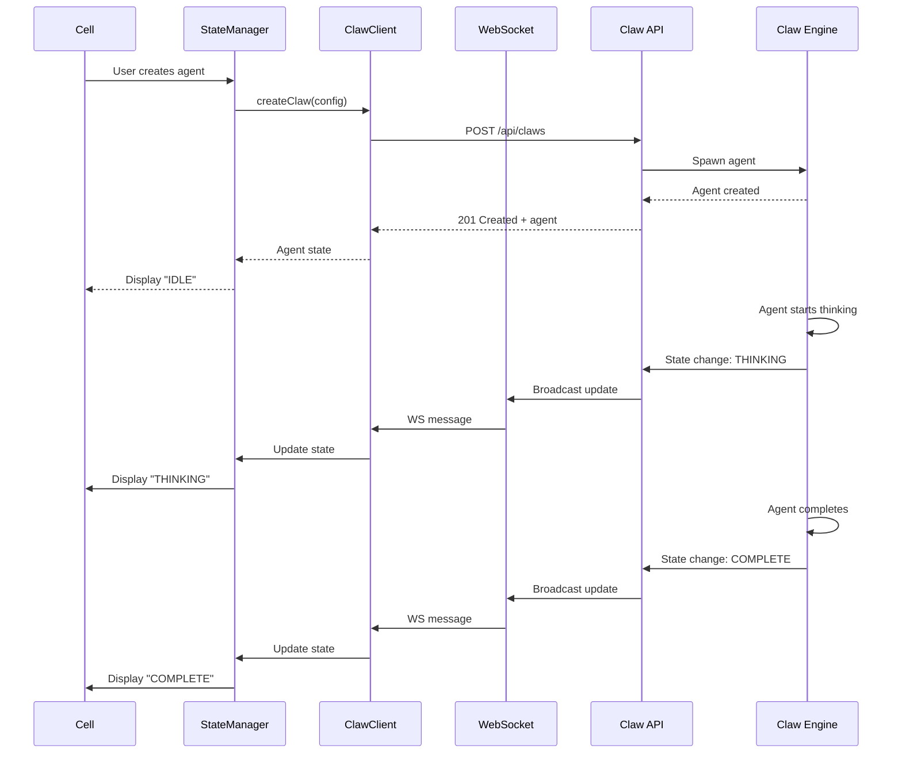
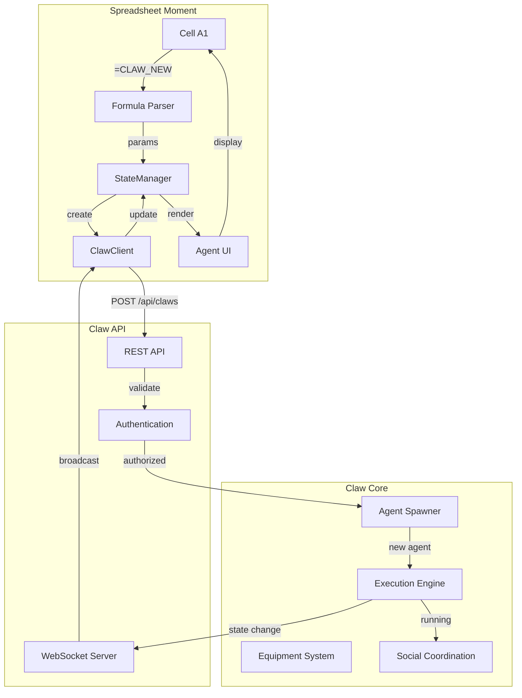
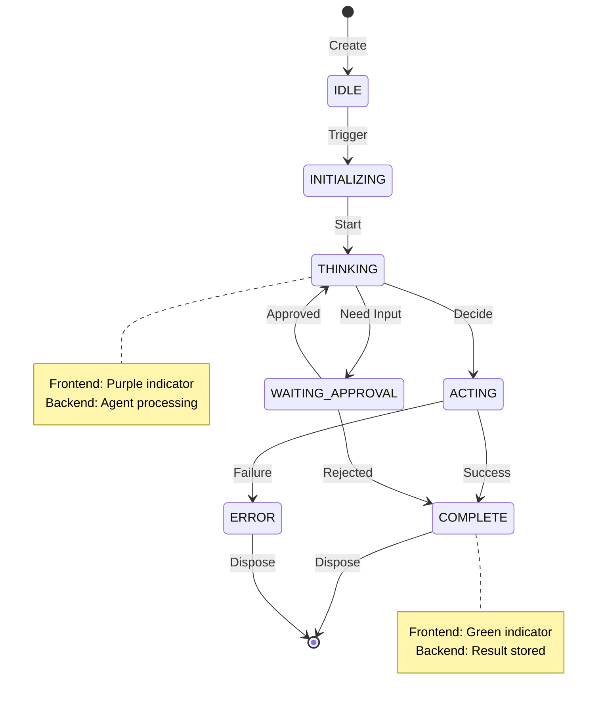

# Claw Integration Plan
**Repository:** spreadsheet-moment
**Target:** claw-core (https://github.com/SuperInstance/claw)
**Date:** 2026-03-18
**Status:** Ready for Round 6 Integration

---

## Executive Summary

This document outlines the integration plan between spreadsheet-moment (the frontend spreadsheet platform) and claw-core (the cellular agent engine). The goal is to enable spreadsheet cells to host autonomous Claw agents that can think, reason, and coordinate.

**Current State:**
- spreadsheet-moment has agent infrastructure (StateManager, ClawClient, TraceProtocol)
- WebSocket communication protocol defined
- API contracts established
- Mock testing available

**Target State:**
- Live connection to claw-core backend
- Real-time agent execution in spreadsheet cells
- Bi-directional state synchronization
- Production-ready integration

---

## Architecture Overview

### Current Architecture

```
┌─────────────────────────────────────────────────────────────────┐
│                    SPREADSHEET MOMENT                           │
│                      (Frontend)                                 │
├─────────────────────────────────────────────────────────────────┤
│                                                                   │
│  ┌──────────────┐      ┌──────────────┐      ┌──────────────┐  │
│  │   Univer     │      │ Agent Core   │      │  Agent UI    │  │
│  │  (Spreadsheet│─────►│  (State Mgr) │─────►│ (Components) │  │
│  │   Engine)    │      │              │      │              │  │
│  └──────────────┘      └──────────────┘      └──────────────┘  │
│                                 │                             │
│                                 ▼                             │
│                          ┌──────────────┐                      │
│                          │ ClawClient   │                      │
│                          │  (HTTP/WS)   │                      │
│                          └──────────────┘                      │
│                                 │                             │
└─────────────────────────────────┼─────────────────────────────┘
                                  │
                                  │ HTTP/WebSocket
                                  │ (Currently Mock)
                                  ▼
┌─────────────────────────────────────────────────────────────────┐
│                       CLAW API SERVER                            │
│                      (Not Yet Connected)                         │
├─────────────────────────────────────────────────────────────────┤
│                                                                   │
│  • REST API for agent management                                 │
│  • WebSocket for real-time updates                               │
│  • Authentication & authorization                                │
│  • Agent lifecycle management                                    │
│                                                                   │
└─────────────────────────────────────────────────────────────────┘
                                  │
                                  ▼
┌─────────────────────────────────────────────────────────────────┐
│                        CLAW-CORE ENGINE                           │
│                      (Cellular Agents)                            │
├─────────────────────────────────────────────────────────────────┤
│                                                                   │
│  • Agent execution engine                                         │
│  • State management                                               │
│  • Equipment system                                               │
│  • Social coordination                                            │
│                                                                   │
└─────────────────────────────────────────────────────────────────┘
```

---

## Integration Points

### 1. Agent Creation Flow

**Current Implementation:** Mock API client
**Target Integration:** Live claw-core backend

**Flow:**
```typescript
// User enters formula in cell A1
=CLAW_NEW("price_monitor", "deepseek-chat", "Monitor price changes")

// 1. Formula parser extracts parameters
const params = {
  name: "price_monitor",
  model: "deepseek-chat",
  purpose: "Monitor price changes"
};

// 2. StateManager creates local state
const agentState = stateManager.createAgent(params);

// 3. ClawClient sends HTTP POST to claw-core
const clawAgent = await clawClient.createClaw({
  name: params.name,
  model: params.model,
  seed: {
    purpose: params.purpose,
    trigger: { type: 'manual' }
  },
  equipment: ['MEMORY', 'REASONING']
});

// 4. ClawClient subscribes to WebSocket updates
clawClient.subscribe(clawAgent.id, (update) => {
  stateManager.updateAgentState(update);
});

// 5. Cell displays agent status
cell.display(agentState);
```

**API Contract:**
```typescript
// POST /api/claws
interface CreateClawRequest {
  name: string;
  model: string;
  seed: {
    purpose: string;
    trigger: TriggerConfig;
    learningStrategy?: LearningStrategy;
  };
  equipment?: EquipmentSlot[];
}

interface CreateClawResponse {
  id: string;
  name: string;
  state: AgentState;
  createdAt: number;
}
```

---

### 2. Agent State Synchronization

**Current Implementation:** Local state only
**Target Integration:** Bi-directional sync with claw-core

**Flow:**


**WebSocket Protocol:**
```typescript
// WS: /ws/claws/{agentId}
interface AgentUpdate {
  agentId: string;
  state: AgentState;
  timestamp: number;
  changes: {
    state?: AgentState;
    result?: any;
    error?: string;
  };
}
```

---

### 3. Agent Query Flow

**Current Implementation:** Mock query
**Target Integration:** Live query to claw-core

**Flow:**
```typescript
// User enters formula in cell A2
=CLAW_QUERY(A1)

// 1. Formula parser resolves cell reference
const agentId = stateManager.getAgentIdFromCell("A1");

// 2. ClawClient queries claw-core
const agent = await clawClient.getClaw(agentId);

// 3. Display agent state
cell.display({
  id: agent.id,
  name: agent.name,
  state: agent.state,
  result: agent.result
});
```

**API Contract:**
```typescript
// GET /api/claws/{id}
interface GetClawResponse {
  id: string;
  name: string;
  model: string;
  state: AgentState;
  seed: ClawSeed;
  equipment: EquipmentSlot[];
  result?: any;
  error?: string;
  createdAt: number;
  updatedAt: number;
}
```

---

### 4. Agent Cancellation Flow

**Current Implementation:** Mock cancellation
**Target Integration:** Live cancellation in claw-core

**Flow:**
```typescript
// User enters formula
=CLAW_CANCEL(A1)

// 1. Resolve agent ID
const agentId = stateManager.getAgentIdFromCell("A1");

// 2. Send cancellation request
await clawClient.cancelClaw(agentId);

// 3. Update local state
stateManager.removeAgent(agentId);
```

**API Contract:**
```typescript
// DELETE /api/claws/{id}
interface CancelClawResponse {
  id: string;
  cancelled: boolean;
  message: string;
}
```

---

## Data Flow Diagrams

### Complete Agent Lifecycle



### State Synchronization



---

## API Contracts

### REST API Endpoints

#### Create Agent
```http
POST /api/claws
Content-Type: application/json
Authorization: Bearer {api_key}

{
  "name": "price_monitor",
  "model": "deepseek-chat",
  "seed": {
    "purpose": "Monitor price changes",
    "trigger": {
      "type": "data",
      "source": "price_api"
    }
  },
  "equipment": ["MEMORY", "REASONING"]
}

Response: 201 Created
{
  "id": "claw_abc123",
  "name": "price_monitor",
  "state": "IDLE",
  "createdAt": 1679157600000
}
```

#### Get Agent
```http
GET /api/claws/{id}
Authorization: Bearer {api_key}

Response: 200 OK
{
  "id": "claw_abc123",
  "name": "price_monitor",
  "model": "deepseek-chat",
  "state": "THINKING",
  "seed": { ... },
  "equipment": ["MEMORY", "REASONING"],
  "createdAt": 1679157600000,
  "updatedAt": 1679157660000
}
```

#### Cancel Agent
```http
DELETE /api/claws/{id}
Authorization: Bearer {api_key}

Response: 200 OK
{
  "id": "claw_abc123",
  "cancelled": true,
  "message": "Agent cancelled successfully"
}
```

#### List Agents
```http
GET /api/claws?limit=10&offset=0
Authorization: Bearer {api_key}

Response: 200 OK
{
  "agents": [
    {
      "id": "claw_abc123",
      "name": "price_monitor",
      "state": "THINKING"
    }
  ],
  "total": 1,
  "limit": 10,
  "offset": 0
}
```

### WebSocket Protocol

#### Connection
```javascript
// Connect to agent-specific WebSocket
const ws = new WebSocket('ws://localhost:8080/ws/claws/claw_abc123');

// Authenticate
ws.send(JSON.stringify({
  type: 'auth',
  token: 'your-api-key'
}));

// Subscribe to updates
ws.send(JSON.stringify({
  type: 'subscribe',
  agentId: 'claw_abc123'
}));
```

#### Message Format
```javascript
// Server → Client
{
  "type": "state_update",
  "agentId": "claw_abc123",
  "state": "THINKING",
  "timestamp": 1679157660000,
  "changes": {
    "state": "THINKING",
    "previousState": "IDLE"
  }
}

// Server → Client (Result)
{
  "type": "agent_complete",
  "agentId": "claw_abc123",
  "state": "COMPLETE",
  "result": {
    "summary": "Price increased by 5%",
    "actions": ["alert_sent"]
  }
}

// Server → Client (Error)
{
  "type": "agent_error",
  "agentId": "claw_abc123",
  "state": "ERROR",
  "error": "Failed to connect to price API"
}
```

---

## Required Changes

### In spreadsheet-moment (Frontend)

#### 1. Update ClawClient
**File:** `packages/agent-core/src/api/claw-client.ts`

**Changes:**
- Replace mock responses with real HTTP calls
- Add WebSocket connection management
- Implement reconnection logic
- Add error handling

**Before:**
```typescript
async createClaw(config: CreateClawRequest): Promise<ClawAgent> {
  // Mock implementation
  return mockAgent;
}
```

**After:**
```typescript
async createClaw(config: CreateClawRequest): Promise<ClawAgent> {
  const response = await fetch(`${this.baseUrl}/api/claws`, {
    method: 'POST',
    headers: {
      'Content-Type': 'application/json',
      'Authorization': `Bearer ${this.apiKey}`
    },
    body: JSON.stringify(config)
  });

  if (!response.ok) {
    throw new Error(`Failed to create claw: ${response.statusText}`);
  }

  return response.json();
}
```

#### 2. Implement WebSocket Manager
**File:** `packages/agent-core/src/websocket/websocket-manager.ts`

**New File:**
```typescript
export class WebSocketManager {
  private ws: WebSocket | null = null;
  private reconnectAttempts = 0;
  private maxReconnectAttempts = 5;

  connect(agentId: string, apiKey: string) {
    const url = `ws://localhost:8080/ws/claws/${agentId}`;
    this.ws = new WebSocket(url);

    this.ws.onopen = () => {
      // Authenticate
      this.ws?.send(JSON.stringify({
        type: 'auth',
        token: apiKey
      }));
    };

    this.ws.onmessage = (event) => {
      const update = JSON.parse(event.data);
      this.handleUpdate(update);
    };

    this.ws.onclose = () => {
      this.reconnect(agentId, apiKey);
    };
  }

  private reconnect(agentId: string, apiKey: string) {
    if (this.reconnectAttempts < this.maxReconnectAttempts) {
      this.reconnectAttempts++;
      setTimeout(() => {
        this.connect(agentId, apiKey);
      }, 1000 * this.reconnectAttempts);
    }
  }
}
```

#### 3. Update Environment Configuration
**File:** `.env` or `packages/agent-core/.env`

**Add:**
```env
# Claw API Configuration
CLAW_API_BASE_URL=http://localhost:8080
CLAW_API_KEY=your-api-key-here
CLAW_WS_URL=ws://localhost:8080
```

### In claw-core (Backend)

#### 1. Implement REST API
**Required Endpoints:**
- POST /api/claws - Create agent
- GET /api/claws/{id} - Get agent
- DELETE /api/claws/{id} - Cancel agent
- GET /api/claws - List agents

#### 2. Implement WebSocket Server
**Required:**
- /ws/claws/{id} endpoint
- Authentication via token
- Real-time state broadcasting
- Connection management

#### 3. Add Authentication
**Required:**
- API key generation
- JWT token validation
- Scope-based authorization

---

## Testing Strategy

### Phase 1: Mock Testing (Current)
- ✅ Unit tests with mock API
- ✅ Integration tests with mock server
- ✅ E2E tests with mock backend

### Phase 2: Integration Testing (Next)
- [ ] Test with real claw-core backend
- [ ] Test WebSocket connection
- [ ] Test error scenarios
- [ ] Test reconnection logic

### Phase 3: E2E Testing (Final)
- [ ] Full agent lifecycle
- [ ] Multiple concurrent agents
- [ ] State synchronization
- [ ] Error recovery

---

## Deployment Plan

### Development Environment
1. Run claw-core locally (port 8080)
2. Configure spreadsheet-moment to connect to localhost
3. Test integration locally

### Staging Environment
1. Deploy claw-core to staging server
2. Configure spreadsheet-moment with staging URL
3. Test in staging environment

### Production Environment
1. Deploy claw-core to production
2. Configure spreadsheet-moment with production URL
3. Enable HTTPS and WSS
4. Monitor performance and errors

---

## Success Criteria

### Technical
- ✅ REST API endpoints implemented
- ✅ WebSocket server operational
- ✅ Authentication working
- ✅ State synchronization functional
- ✅ Error handling robust
- ✅ Reconnection logic working

### Performance
- ✅ Agent creation <100ms
- ✅ State updates <50ms
- ✅ WebSocket latency <100ms
- ✅ Support 100+ concurrent agents

### Reliability
- ✅ 99.9% uptime
- ✅ Automatic reconnection
- ✅ Graceful error handling
- ✅ Comprehensive logging

---

## Risks & Mitigation

### Risk 1: Backend Unavailability
**Impact:** High
**Mitigation:** Implement robust reconnection logic, queue operations when offline

### Risk 2: State Desynchronization
**Impact:** High
**Mitigation:** Implement state versioning, conflict resolution, periodic reconciliation

### Risk 3: Performance Degradation
**Impact:** Medium
**Mitigation:** Implement caching, batch updates, pagination

### Risk 4: Security Issues
**Impact:** High
**Mitigation:** Implement proper authentication, authorization, rate limiting

---

## Next Steps (Round 6)

1. **Setup claw-core backend**
   - Deploy claw-core locally
   - Configure API endpoints
   - Generate API keys

2. **Update spreadsheet-moment**
   - Implement real HTTP client
   - Implement WebSocket manager
   - Update environment configuration

3. **Test integration**
   - Unit tests with real backend
   - Integration tests
   - E2E tests

4. **Deploy & Monitor**
   - Deploy to staging
   - Monitor performance
   - Fix issues

5. **Production rollout**
   - Deploy to production
   - Monitor metrics
   - Iterate

---

**Document Status:** Ready for Implementation
**Next Phase:** Round 6 - Claw Integration
**Dependencies:** claw-core backend deployed
**Timeline:** 2-3 weeks

---

**Last Updated:** 2026-03-18
**Author:** Round 5 Streamlining Agent
**Review Status:** Pending Review
