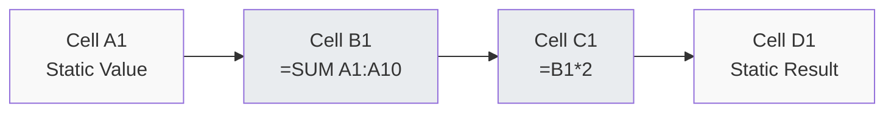
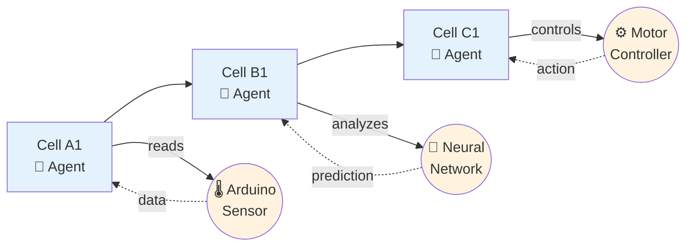
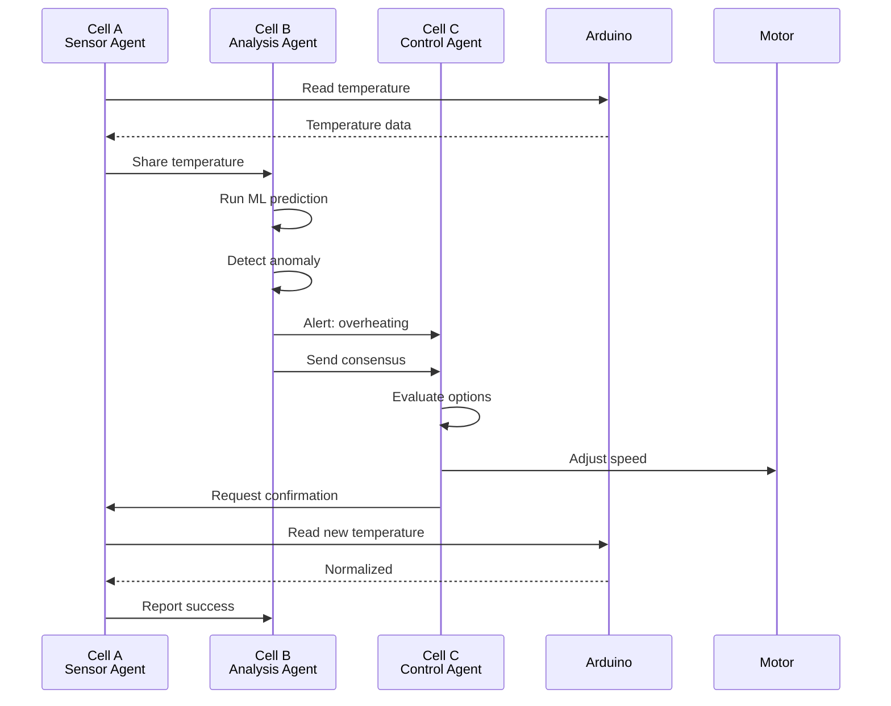
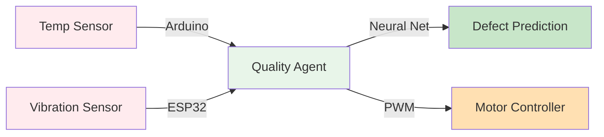
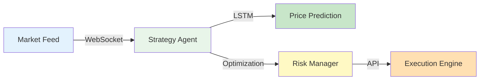

# SpreadsheetMoment

[](LICENSE)
[](https://spreadsheet-moment.pages.dev)

**Transform spreadsheet cells into intelligent agents.**

---

## The Concept

### Traditional Spreadsheets



**Problem:** Cells contain static values or formulas. They can't:
- Connect to external data sources
- Reason about data
- Coordinate with each other
- Take autonomous action

### SpreadsheetMoment



**Solution:** Each cell is an intelligent agent that:
- Connects to hardware, APIs, databases
- Reasons about data using ML
- Coordinates with other cells
- Takes autonomous action

### How It Works



**Result:** Three cells coordinated autonomously to solve a problem — without explicit programming.

---

## What You Can Build

### Smart Manufacturing



**Flow:** Sensors → Analysis → Prediction → Action

### Financial Trading



**Flow:** Real-time data → Prediction → Risk Analysis → Trade

---

## Quick Start

```bash
git clone https://github.com/SuperInstance/spreadsheet-moment.git
cd spreadsheet-moment/website
npm install
npm run dev
```

Visit http://localhost:3000

**Live Demo:** https://spreadsheet-moment.pages.dev

---

## Example

```typescript
import { SuperInstance } from '@spreadsheet-moment/core';

const cell = SuperInstance.create({
  type: 'sensor',
  connections: ['arduino://A0', 'https://api.weather.com']
});

cell.on('update', (data) => console.log(data));
```

---

## Documentation

- [Getting Started](https://spreadsheet-moment.pages.dev/docs.html)
- [Architecture](docs/ARCHITECTURE.md)
- [API Reference](docs/API_DOCUMENTATION.md)
- [Deployment](docs/deployment/)

---

## Research Foundation

| Paper | Venue | Contribution |
|-------|-------|--------------|
| P01-P10 | Foundations | Core architecture |
| P11-P20 | NeurIPS 2024 | SE(3) consensus |
| P21-P30 | ICML 2024 | Meta-learning |
| P51-P60 | - | Hardware integration |
| P61-P65 | - | Ancient cell applications |

**[Complete Research →](https://github.com/SuperInstance/SuperInstance-papers)**

---

## License

MIT — see [LICENSE](LICENSE)

---

**Website:** https://spreadsheet-moment.pages.dev
**GitHub:** https://github.com/SuperInstance/spreadsheet-moment
**Research:** https://github.com/SuperInstance/SuperInstance-papers
