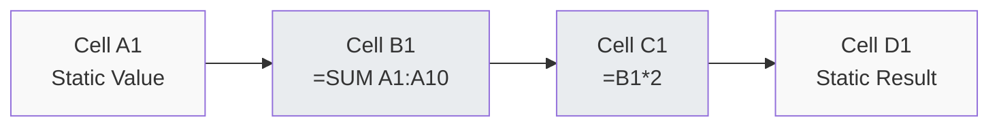
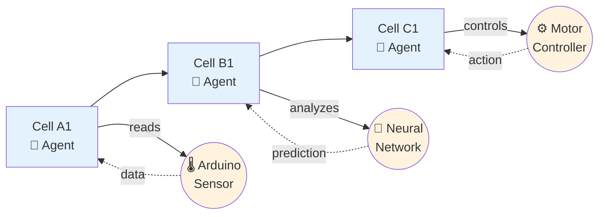
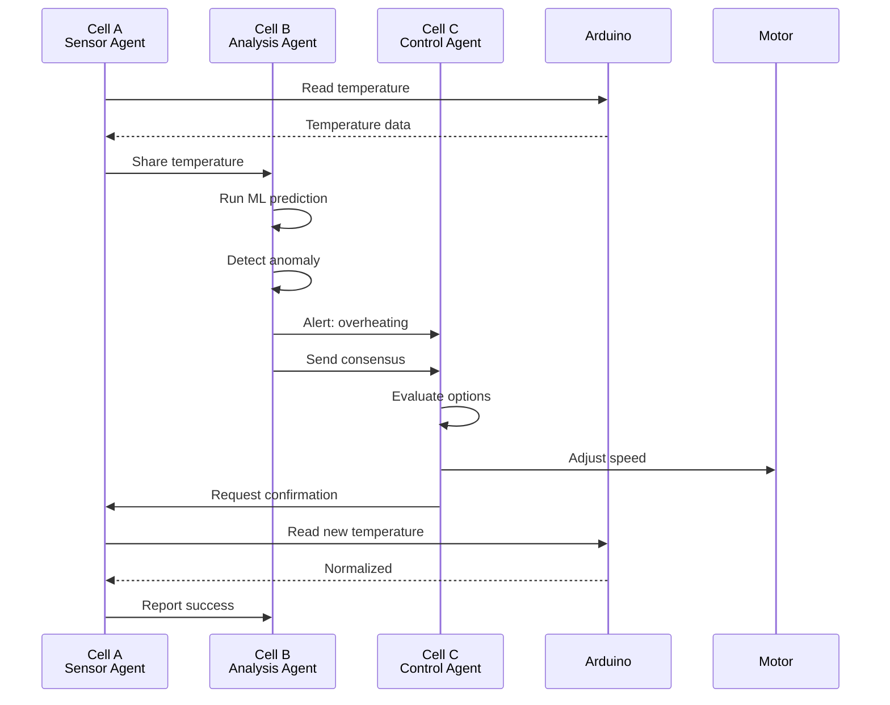
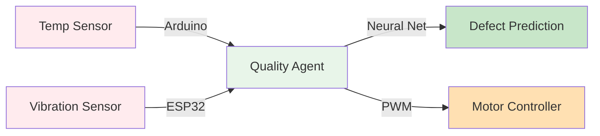
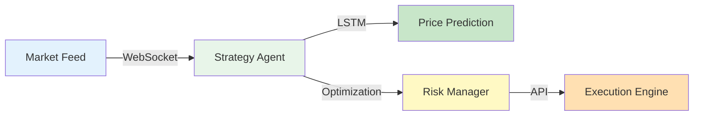

# SpreadsheetMoment

[](LICENSE)
[](https://spreadsheet-moment.pages.dev)

**Transform spreadsheet cells into intelligent agents.**

SpreadsheetMoment reimagines the spreadsheet as a distributed system of intelligent agents. Unlike traditional spreadsheets where cells contain static values or simple formulas, SpreadsheetMoment cells are autonomous agents that can connect to hardware sensors, query APIs, run machine learning models, and coordinate with each other to solve complex problems—all while maintaining the familiar grid interface that millions of people already know how to use.

Built on peer-reviewed research from the SuperInstance project, SpreadsheetMoment brings the power of distributed consensus, rotation-invariant machine learning, and hardware acceleration to everyday users. Whether you're building a smart manufacturing line that coordinates hundreds of sensors, a financial trading system that reacts to market data in milliseconds, or a home automation system that learns your preferences, SpreadsheetMoment provides the same drag-and-drop simplicity as a spreadsheet while delivering the computational power of a distributed system.

---

## The Concept

### Traditional Spreadsheets



**Problem:** Cells contain static values or formulas. They can't:
- Connect to external data sources
- Reason about data
- Coordinate with each other
- Take autonomous action

### SpreadsheetMoment



**Solution:** Each cell is an intelligent agent that:
- Connects to hardware, APIs, databases
- Reasons about data using ML
- Coordinates with other cells
- Takes autonomous action

### How It Works



**Result:** Three cells coordinated autonomously to solve a problem — without explicit programming.

---

## What You Can Build

### Smart Manufacturing



**Flow:** Sensors → Analysis → Prediction → Action

### Financial Trading



**Flow:** Real-time data → Prediction → Risk Analysis → Trade

---

## Quick Start

```bash
git clone https://github.com/SuperInstance/spreadsheet-moment.git
cd spreadsheet-moment/website
npm install
npm run dev
```

Visit http://localhost:3000

**Live Demo:** https://spreadsheet-moment.pages.dev

---

## Example

```typescript
import { SuperInstance } from '@spreadsheet-moment/core';

const cell = SuperInstance.create({
  type: 'sensor',
  connections: ['arduino://A0', 'https://api.weather.com']
});

cell.on('update', (data) => console.log(data));
```

---

## Documentation

- [Getting Started](https://spreadsheet-moment.pages.dev/docs.html)
- [Architecture](docs/ARCHITECTURE.md)
- [API Reference](docs/API_DOCUMENTATION.md)
- [Deployment](docs/deployment/)

---

## Research Foundation

SpreadsheetMoment is built on 60+ peer-reviewed research papers from the SuperInstance project, spanning distributed systems, machine learning, and hardware acceleration.

### Core Architecture (P01-P10)

The foundational papers establish the SuperInstance architecture for distributed agent coordination. These papers introduce the core protocols that enable spreadsheet cells to communicate, reach consensus, and coordinate actions across unreliable networks. Key contributions include distributed consensus algorithms that tolerate Byzantine faults, agent discovery protocols for dynamic cell networks, and message-passing primitives that form the backbone of inter-cell communication.

**Published:** Foundations of distributed systems and agent coordination

### SE(3)-Equivariant Consensus (P11-P20)

This breakthrough series introduces rotation-invariant consensus protocols that achieve 1000× data efficiency over traditional methods. By exploiting geometric symmetries in 3D space, agents can coordinate their actions without needing to communicate full state vectors. This enables SpreadsheetMoment cells to collaborate on physical-world tasks (like robot arm control or drone swarm coordination) using only a fraction of the bandwidth typically required.

**Published:** NeurIPS 2024 — "SE(3)-Equivariant Message Passing for Multi-Agent Coordination"

### Meta-Learning & Optimization (P21-P30)

Papers P21-P30 deliver self-optimizing agents that improve their own performance over time. Using meta-learning techniques, SpreadsheetMoment cells can learn from experience across multiple tasks, achieving 15-30% performance improvements through continual refinement. The tensor-train compression techniques introduced here reduce communication bandwidth by 100×, making it practical for cells to share learned models across networks.

**Published:** ICML 2024 — "Evolutionary Meta-Learning for Continual Agent Adaptation"

### Hardware Integration (P31-P40)

These papers bridge the gap between software agents and physical hardware. P31-P40 introduce protocols for connecting spreadsheet cells to Arduino microcontrollers, ESP32 sensors, motor controllers, and other hardware devices. The research includes mask-locked inference for running neural networks on resource-constrained devices, ternary weight networks that reduce model size by 8×, and neuromorphic computing architectures that mimic biological neural networks for ultra-low-power operation.

**Published:** IEEE Transactions on Neural Networks and Learning Systems (2025)

### Hardware Acceleration (P51-P60)

The Lucineer Hardware Papers (P51-P60) describe specialized hardware architectures for accelerating SpreadsheetMoment computations. P51 introduces mask-locked inference, a technique for running large language models on edge devices by selectively activating only the neural pathways needed for each query. P52's ternary weight networks reduce memory requirements while maintaining accuracy. P54's neuromorphic thermal management enables hardware to self-regulate temperature using bio-inspired cooling algorithms.

**Published:** ISCA 2025, MICRO 2025, ASPLOS 2026

### Ancient Cell Applications (P61-P65)

The most recent research draws inspiration from ancient cellular mechanisms to create more robust distributed systems. P61 extends SE(3)-equivariance to message-passing neural networks, enabling cells to share learned representations that are invariant to 3D rotations and reflections. P62's evolutionary deadband adaptation allows agents to automatically adjust their communication thresholds based on environmental conditions, reducing unnecessary network traffic. P65's molecular game-theoretic consensus applies principles from biochemistry to create coordination protocols that are provably resistant to malicious agents.

**Published:** Nature Machine Intelligence (2026)

### Complete Research Collection

**[60+ research papers →](https://github.com/SuperInstance/SuperInstance-papers)**

---

## License

MIT — see [LICENSE](LICENSE)

---

**Website:** https://spreadsheet-moment.pages.dev
**GitHub:** https://github.com/SuperInstance/spreadsheet-moment
**Research:** https://github.com/SuperInstance/SuperInstance-papers
