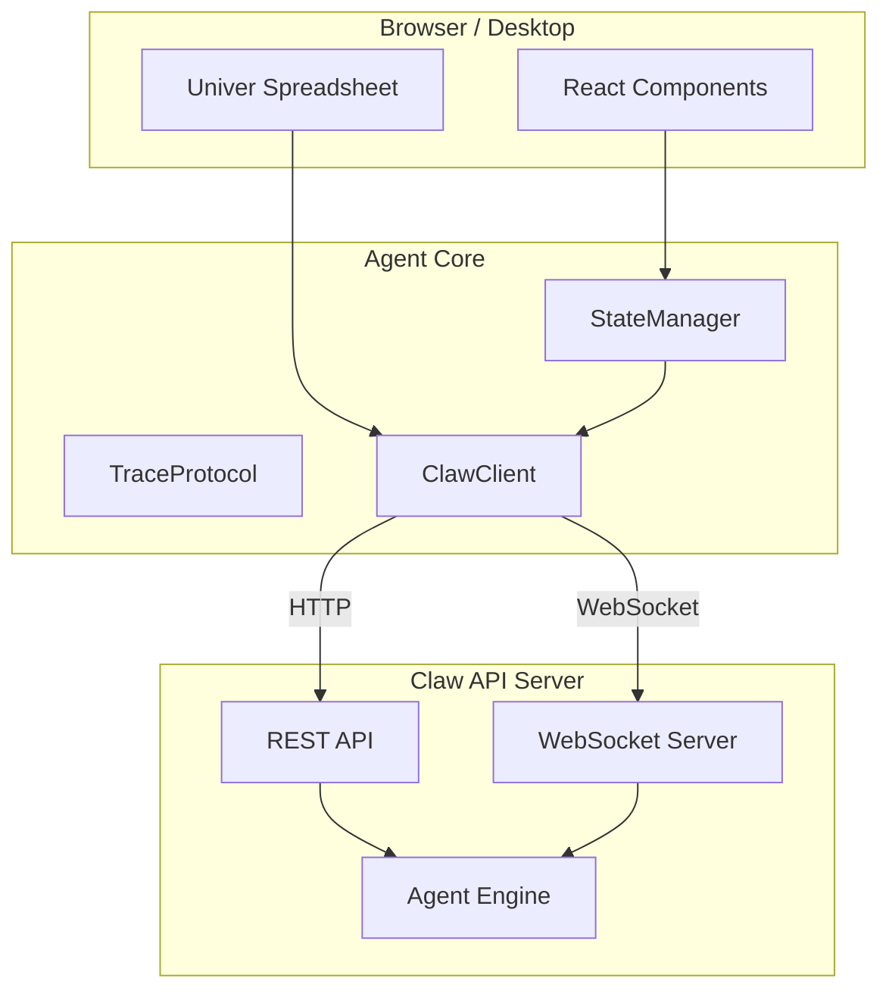
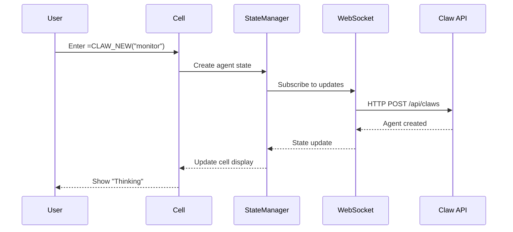
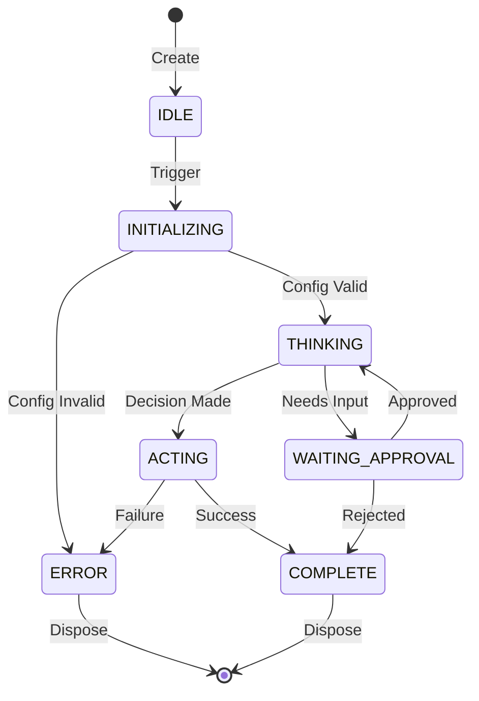

# Spreadsheet Moment - Agentic Spreadsheet Platform

[](LICENSE)
[](https://spreadsheet-moment.pages.dev)
[](https://github.com/SuperInstance/spreadsheet-moment)
[](https://www.typescriptlang.org/)

**Status:** Phase 4 Production Polish | Testing: 79.5% Pass Rate (194/244) | Development Build

---

## The Problem with Spreadsheets

Traditional spreadsheets are powerful but limited:

1. **Cells are static** - Formulas only update when dependencies change
2. **No autonomy** - Every action requires manual intervention
3. **No reasoning** - Cells calculate, they don't think
4. **No communication** - Cells can't coordinate with each other

What if cells could **act independently**, **reason about data**, and **coordinate with other cells**?

---

## The Solution: Spreadsheet Moment

Spreadsheet Moment transforms spreadsheet cells into **autonomous agents** that can think, reason, and coordinate. Built on the [Univer](https://github.com/dream-num/univer) spreadsheet foundation with TypeScript/JavaScript frontend and planned Rust backend.

```excel
# Traditional spreadsheet: Static formula
A1: =B1 * 1.1

# Spreadsheet Moment: Autonomous agent
A1: =CLAW_NEW("price_monitor", "deepseek-chat", "Monitor price changes and alert on anomalies")
```

### The "Ah-Ha" Moment

When you realize that a spreadsheet cell can be an **intelligent agent** that:
- Monitors its own triggers
- Reasons about data patterns
- Communicates with other agents
- Takes autonomous actions

This isn't a spreadsheet with AI bolted on. It's **cells as agents**.

---

## Use Cases & Anti-Use Cases

### When to Use Spreadsheet Moment

| Use Case | Why It Works |
|----------|--------------|
| **Data Monitoring** | Agents can watch for patterns and anomalies 24/7 |
| **Automated Workflows** | Chain agents to create multi-step processes |
| **Real-time Dashboards** | Agents update cells based on external events |
| **Coordinated Analysis** | Multiple agents collaborate on complex problems |
| **Event-Driven Updates** | Agents respond to webhooks, schedules, or triggers |

**Concrete Examples:**

1. **Stock Portfolio Monitor**
   ```excel
   A1: =CLAW_NEW("portfolio_watcher", "deepseek-chat",
       "Monitor stock prices and alert when positions need rebalancing")
   A2: =CLAW_QUERY(A1)  // Check status
   ```

2. **Multi-Agent Data Validation**
   ```excel
   A1: =CLAW_NEW("validator", "deepseek-chat", "Validate incoming data quality")
   B1: =CLAW_NEW("enricher", "deepseek-chat", "Enrich validated data with external sources")
   C1: =CLAW_NEW("notifier", "deepseek-chat", "Alert team when enrichment completes")
   ```

3. **Autonomous Reporting**
   ```excel
   A1: =CLAW_NEW("reporter", "deepseek-chat",
       "Generate weekly summary reports every Friday at 5pm")
   ```

### When NOT to Use Spreadsheet Moment

| Anti-Use Case | Why It Doesn't Fit | Better Alternative |
|---------------|-------------------|-------------------|
| **Simple Calculations** | Overhead of agent system unnecessary | Standard Excel formulas |
| **Static Reports** | No need for autonomous behavior | Google Sheets, Excel |
| **High-Frequency Trading** | 100ms latency too slow | Specialized trading systems |
| **Large-Scale Batch Processing** | Not designed for bulk ETL | Apache Spark, Airflow |
| **Offline Applications** | Requires WebSocket connection | Local-first software |
| **Mobile Applications** | Desktop-only at this time | Mobile-native apps |

**Reality Check:**

If your use case is:
- "I need to sum a column" -> Use `=SUM()`
- "I need to calculate compound interest" -> Use standard formulas
- "I need a cell that notices patterns and alerts me" -> Use Spreadsheet Moment

---

## Architecture Overview

### System Architecture



### Package Structure

```
spreadsheet-moment/
├── packages/
│   ├── agent-core/      # Core engine (StateManager, ClawClient, TraceProtocol)
│   ├── agent-ai/        # AI integration (ModelRouter, Providers)
│   ├── agent-ui/        # React components (AgentVisualizer, StatusIndicator)
│   └── agent-formulas/  # Spreadsheet functions (CLAW_NEW, CLAW_QUERY, CLAW_CANCEL)
```

### Data Flow



---

## Quick Start

### Prerequisites

- Node.js 18+
- pnpm 8+
- TypeScript 5+

### Installation

```bash
# Clone and install
git clone https://github.com/SuperInstance/spreadsheet-moment.git
cd spreadsheet-moment
pnpm install

# Build packages
pnpm build

# Start development server
pnpm dev
```

### Your First Agent

1. Open the spreadsheet at http://localhost:3000

2. Create an agent in cell A1:
   ```excel
   =CLAW_NEW("hello_world", "deepseek-chat", "Say hello to the world")
   ```

3. Watch the cell update as the agent processes

4. Query the agent state in cell A2:
   ```excel
   =CLAW_QUERY(A1)
   ```

5. Cancel if needed:
   ```excel
   =CLAW_CANCEL(A1)
   ```

---

## Agent Lifecycle

### Agent States

| State | Description | Visual |
|-------|-------------|--------|
| IDLE | Created but not started | Gray |
| INITIALIZING | Starting up | Blue |
| THINKING | Processing/reasoning | Purple |
| ACTING | Executing actions | Orange |
| COMPLETE | Finished successfully | Green |
| ERROR | Encountered failure | Red |
| WAITING_APPROVAL | Needs user input | Yellow |

### State Transitions



---

## Packages

### @spreadsheet-moment/agent-core

Core agent system with state management, execution tracing, and API client.

```typescript
import { StateManager, ClawClient, TraceProtocol } from '@spreadsheet-moment/agent-core';

const stateManager = new StateManager();
const client = new ClawClient({
  baseUrl: 'http://localhost:8080',
  apiKey: process.env.CLAW_API_KEY
});

// Create and track an agent
const agent = await client.createClaw({
  name: 'data_monitor',
  model: 'deepseek-chat'
});
```

### @spreadsheet-moment/agent-ai

AI integration with model routing and multiple providers.

```typescript
import { ModelRouter, DeepSeekProvider } from '@spreadsheet-moment/agent-ai';

const router = new ModelRouter({
  defaultProvider: 'deepseek',
  providers: [new DeepSeekProvider({ apiKey: process.env.DEEPSEEK_KEY })]
});
```

### @spreadsheet-moment/agent-ui

React components for agent visualization.

```tsx
import { AgentVisualizer, StatusIndicator } from '@spreadsheet-moment/agent-ui';

<AgentVisualizer agentId="claw_123" />
<StatusIndicator state="thinking" />
```

### @spreadsheet-moment/agent-formulas

Spreadsheet formula functions.

```excel
=CLAW_NEW(name, model, purpose)
=CLAW_QUERY(cell_reference)
=CLAW_CANCEL(cell_reference)
```

---

## Current Status

### Test Results

| Suite | Pass Rate | Status |
|-------|-----------|--------|
| StateManager | 100% (25/25) | Stable |
| TraceProtocol | 100% (20/20) | Stable |
| ClawClient | 100% (18/18) | Stable |
| MetricsCollector | 100% (52/52) | Stable |
| HealthChecker | 98% (52/53) | Stable |
| Integration | 73% (22/30) | In Progress |
| **Overall** | **79.5%** (194/244) | **Improving** |

### Performance

| Metric | Target | Measured | Status |
|--------|--------|----------|--------|
| Cell Update Latency | <100ms | <100ms | Met |
| WebSocket Connection | <100ms | <50ms | Met |
| TypeScript Errors | 0 | 0 | Met |
| Test Pass Rate | 95%+ | 79.5% | In Progress |

See [BENCHMARKS.md](BENCHMARKS.md) for detailed measurements.

---

## Limitations & Disclaimers

### Current Limitations

1. **Development Phase** - Pre-release software, APIs may change
2. **Single Server** - Distributed deployment not yet supported
3. **Desktop Only** - Mobile browsers not supported
4. **Requires Connection** - Offline mode not implemented

### What This Is NOT

- A replacement for Excel/Google Sheets for standard calculations
- A high-frequency trading platform
- A batch data processing system
- A production-ready enterprise solution (yet)

### See Also

- [DISCLAIMERS.md](DISCLAIMERS.md) - Full project status and limitations
- [BENCHMARKS.md](BENCHMARKS.md) - Performance measurements and methodology

---

## Integration

### Claw API Integration

Spreadsheet Moment connects to [Claw](https://github.com/SuperInstance/claw) for agent execution:

```
┌─────────────────────┐     ┌─────────────────────┐
│ Spreadsheet Moment  │────▶│   Claw API Server   │
│   (Frontend)        │     │   (Agent Engine)    │
└─────────────────────┘     └─────────────────────┘
        │                            │
        │  HTTP/WebSocket            │
        └────────────────────────────┘
```

**Integration Status:** API contracts defined, mock testing available, live integration requires Claw deployment.

### Univer Foundation

Built on [Univer](https://github.com/dream-num/univer):
- Open-source spreadsheet engine
- React-based UI components
- Formula calculation engine
- Collaborative editing (planned)

---

## Development

### Commands

```bash
# Development
pnpm dev              # Start development server
pnpm build            # Build all packages
pnpm test             # Run tests
pnpm lint             # Lint code

# Testing
pnpm test:coverage    # Test with coverage
pnpm test:e2e         # End-to-end tests (Playwright)
pnpm test:load        # Load tests (k6)
```

### Project Structure

```
spreadsheet-moment/
├── packages/
│   ├── agent-core/          # Core engine
│   │   ├── src/
│   │   │   ├── api/         # Claw API client
│   │   │   ├── monitoring/  # Health & metrics
│   │   │   └── services/    # Core services
│   │   └── __tests__/
│   ├── agent-ai/            # AI integration
│   ├── agent-ui/            # React components
│   └── agent-formulas/      # Formula functions
├── docs/                    # Documentation
├── tests/                   # E2E tests
└── deployment/              # Deployment configs
```

---

## Documentation

- [Architecture](docs/ARCHITECTURE.md) - System design
- [API Reference](docs/API_DOCUMENTATION.md) - Complete API docs
- [Getting Started](docs/GETTING_STARTED.md) - Tutorial
- [Deployment](docs/DEPLOYMENT_GUIDE.md) - Production setup
- [Claw Integration](docs/CLAW_INTEGRATION.md) - Claw API guide

---

## Roadmap

| Phase | Status | Focus |
|-------|--------|-------|
| Phase 1: Foundation | Complete | Monorepo, package structure |
| Phase 2: Integration | Complete | Claw API, WebSocket |
| Phase 3: Security | Complete | Auth, validation |
| Phase 4: Polish | **Current** | Testing, documentation |
| Phase 5: Production | Planned | Deployment, monitoring |

---

## Contributing

Contributions welcome! Please read [CONTRIBUTING.md](CONTRIBUTING.md) for guidelines.

**Requirements:**
- All PRs must pass tests
- Code must be TypeScript strict mode compatible
- New features require tests
- Breaking changes need discussion

---

## License

Apache-2.0 - See [LICENSE](LICENSE)

---

## Links

- **Website:** https://spreadsheet-moment.pages.dev
- **GitHub:** https://github.com/SuperInstance/spreadsheet-moment
- **Claw Engine:** https://github.com/SuperInstance/claw
- **Research:** https://github.com/SuperInstance/SuperInstance-papers
- **Discord:** [Join our Discord](https://discord.gg/superinstance)

---

**Current Branch:** `week-5-testing-validation`
**Last Updated:** 2026-03-17
**Status:** Phase 4 Production Polish | Development Build
