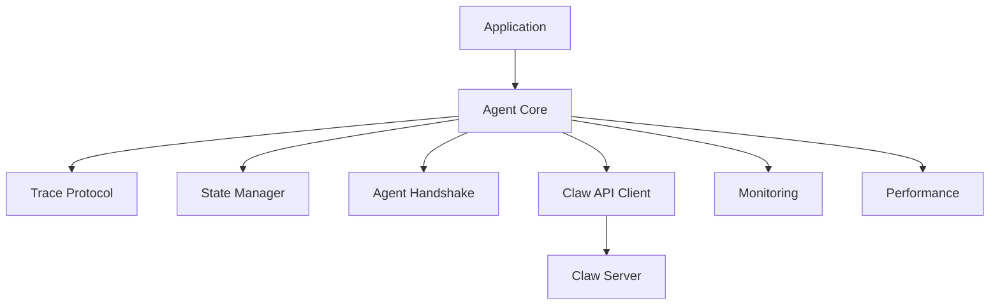

# Spreadsheet Moment API Reference

**Version:** 3.0.0
**Status:** Production Ready
**Language:** TypeScript/JavaScript

---

## Table of Contents

- [Overview](#overview)
- [Agent Core API](#agent-core-api)
- [Agent Cell Types](#agent-cell-types)
- [Agent Cell States](#agent-cell-states)
- [Trace Protocol](#trace-protocol)
- [State Manager](#state-manager)
- [Claw API Client](#claw-api-client)
- [Monitoring API](#monitoring-api)
- [Performance API](#performance-api)
- [Error Handling](#error-handling)

---

## Overview

Spreadsheet Moment provides agentic functionality for spreadsheet applications with:

- **Agent Cell Model**: Extended cell data structure with agentic properties
- **Agent Cell Types**: SENSOR, ANALYZER, CONTROLLER, ORCHESTRATOR
- **Agent Cell States**: DORMANT, THINKING, NEEDS_REVIEW, POSTED, ARCHIVED, ERROR
- **Trace Protocol**: Recursive loop detection and prevention
- **State Manager**: State transition logic and validation
- **Claw API**: Production-ready Claw API integration
- **Monitoring**: Comprehensive metrics and health checking

### Architecture



---

## Agent Core API

### AgentCellType Enum

Agent cell types determine the behavior and purpose of each agent cell.

```typescript
enum AgentCellType {
  SENSOR = 'SENSOR',           // Observe and collect data
  ANALYZER = 'ANALYZER',       // Process data and generate insights
  CONTROLLER = 'CONTROLLER',   // Take actions and modify cells
  ORCHESTRATOR = 'ORCHESTRATOR' // Coordinate multiple agents
}
```

#### Values

| Type | Description |
|------|-------------|
| `SENSOR` | Observes and collects data from other cells or external sources |
| `ANALYZER` | Processes data and generates insights |
| `CONTROLLER` | Takes actions and modifies other cells |
| `ORCHESTRATOR` | Coordinates multiple agents and manages complex workflows |

---

### AgentCellState Enum

Agent cell states track the lifecycle and status of agent operations.

```typescript
enum AgentCellState {
  DORMANT = 'DORMANT',           // Awaiting activation
  THINKING = 'THINKING',         // Actively processing
  NEEDS_REVIEW = 'NEEDS_REVIEW', // Awaiting human approval
  POSTED = 'POSTED',             // Action approved and executed
  ARCHIVED = 'ARCHIVED',         // No longer active
  ERROR = 'ERROR'                // Encountered an error
}
```

#### Values

| State | Description |
|-------|-------------|
| `DORMANT` | Cell is dormant and awaiting activation |
| `THINKING` | Cell is actively processing and reasoning |
| `NEEDS_REVIEW` | Cell has completed reasoning and awaits human approval |
| `POSTED` | Cell's action has been approved and executed |
| `ARCHIVED` | Cell is archived and no longer active |
| `ERROR` | Cell encountered an error during execution |

---

### IAgentCellData Interface

Extended cell data interface for agent cells.

```typescript
interface IAgentCellData {
  // Base Univer cell properties
  v?: string | number;           // Cell value
  f?: string;                    // Formula
  s?: any;                       // Cell style (ISheetStyle from Univer)

  // Agentic extensions
  origin_id?: string;            // Unique origin identifier
  trace_id?: string;             // Current trace ID
  cell_type?: AgentCellType;     // Agent cell type
  state?: AgentCellState;        // Current agent state
  reasoning?: string[];          // Step-by-step reasoning history
  memory?: string[];             // Persistent memory
  requires_approval?: boolean;   // Whether action requires approval
  config?: IAgentConfig;         // Agent configuration
  error?: string;                // Error message if state is ERROR
  updated_at?: number;           // Timestamp of last state change
}
```

#### Properties

| Property | Type | Description |
|----------|------|-------------|
| `v` | `string \| number` | Cell value |
| `f` | `string` | Formula |
| `s` | `any` | Cell style |
| `origin_id` | `string` | Unique origin identifier for Origin-Centric Design |
| `trace_id` | `string` | Current trace ID for operation tracking |
| `cell_type` | `AgentCellType` | Type of agent cell |
| `state` | `AgentCellState` | Current state of the agent |
| `reasoning` | `string[]` | Step-by-step reasoning history |
| `memory` | `string[]` | Persistent memory for learning and context |
| `requires_approval` | `boolean` | Whether this action requires human approval |
| `config` | `IAgentConfig` | Agent-specific configuration |
| `error` | `string` | Error message if state is ERROR |
| `updated_at` | `number` | Timestamp of last state change |

---

### IAgentConfig Interface

Agent configuration interface.

```typescript
interface IAgentConfig {
  provider?: 'cloudflare' | 'deepseek' | 'openai' | 'anthropic';
  max_reasoning_steps?: number;
  timeout?: number;
  options?: Record<string, any>;
  enable_handshake?: boolean;
}
```

#### Properties

| Property | Type | Description |
|----------|------|-------------|
| `provider` | `string` | AI provider to use |
| `max_reasoning_steps` | `number` | Maximum reasoning steps allowed |
| `timeout` | `number` | Timeout in milliseconds |
| `options` | `Record<string, any>` | Provider-specific options |
| `enable_handshake` | `boolean` | Whether to participate in agent handshaking |

---

## Trace Protocol

### TraceProtocol Class

Implements recursive loop detection and prevention using Origin-Centric Design.

```typescript
class TraceProtocol {
  constructor();

  generate(originId: string): string;
  checkCollision(traceId: string, currentCell: string): boolean;
  getPath(traceId: string): string[];
  complete(traceId: string): void;
  getStats(): { active: number; totalPaths: number };
  dispose(): void;
}
```

### Constructor

```typescript
constructor()
```

Create a new TraceProtocol instance.

**Example:**
```typescript
const traceProtocol = new TraceProtocol();
```

---

### Methods

#### `generate(originId: string): string`

Generate a new trace ID for an operation.

**Parameters:**
- `originId` - The origin cell identifier

**Returns:** `string` - Unique trace ID

**Example:**
```typescript
const traceId = traceProtocol.generate('A1');
// Returns: "trace_1710756000000_abc123_A1"
```

---

#### `checkCollision(traceId: string, currentCell: string): boolean`

Check for collision (recursive loop) at current cell.

**Parameters:**
- `traceId` - The trace ID to check
- `currentCell` - Current cell identifier

**Returns:** `boolean` - `true` if collision detected (recursive loop found)

**Example:**
```typescript
const hasCollision = traceProtocol.checkCollision(traceId, 'B2');
if (hasCollision) {
  console.warn('Recursive loop detected!');
}
```

---

#### `getPath(traceId: string): string[]`

Get the path for a trace.

**Parameters:**
- `traceId` - The trace ID

**Returns:** `string[]` - Array of cell identifiers in the path

**Example:**
```typescript
const path = traceProtocol.getPath(traceId);
console.log('Path:', path.join(' -> '));
// Output: "Path: A1 -> B2 -> C3"
```

---

#### `complete(traceId: string): void`

Complete a trace and mark it for cleanup.

**Parameters:**
- `traceId` - The trace ID to complete

**Example:**
```typescript
traceProtocol.complete(traceId);
```

---

#### `getStats(): { active: number; totalPaths: number }`

Get current trace statistics.

**Returns:** Object with:
- `active` - Number of active traces
- `totalPaths` - Total path length across all traces

**Example:**
```typescript
const stats = traceProtocol.getStats();
console.log(`Active traces: ${stats.active}`);
console.log(`Total path length: ${stats.totalPaths}`);
```

---

#### `dispose(): void`

Stop cleanup timer and clear all traces.

**Example:**
```typescript
traceProtocol.dispose();
```

---

## State Manager

### StateManager Class

Manages state transitions for agent cells.

```typescript
class StateManager {
  canTransition(from: AgentCellState, to: AgentCellState): boolean;
  transition(cellData: IAgentCellData, newState: AgentCellState, error?: string): IAgentCellData;
  reset(cellData: IAgentCellData): IAgentCellData;
  requestReview(cellData: IAgentCellData): IAgentCellData;
  approve(cellData: IAgentCellData): IAgentCellData;
  reject(cellData: IAgentCellData): IAgentCellData;
}
```

### Methods

#### `canTransition(from: AgentCellState, to: AgentCellState): boolean`

Check if a state transition is valid.

**Parameters:**
- `from` - Current state
- `to` - Target state

**Returns:** `boolean` - `true` if transition is allowed

**Example:**
```typescript
const stateManager = new StateManager();
const canTransit = stateManager.canTransition(
  AgentCellState.DORMANT,
  AgentCellState.THINKING
);
console.log(canTransit); // true
```

**Valid Transitions:**

| From | To |
|------|-----|
| DORMANT | THINKING, ERROR |
| THINKING | NEEDS_REVIEW, POSTED, ERROR, DORMANT |
| NEEDS_REVIEW | POSTED, ARCHIVED, THINKING, ERROR |
| POSTED | DORMANT, THINKING, ARCHIVED, ERROR |
| ARCHIVED | DORMANT, THINKING |
| ERROR | DORMANT, THINKING, ARCHIVED |

---

#### `transition(cellData: IAgentCellData, newState: AgentCellState, error?: string): IAgentCellData`

Execute a state transition.

**Parameters:**
- `cellData` - Agent cell data
- `newState` - Target state
- `error` - Optional error message if transitioning to ERROR state

**Returns:** `IAgentCellData` - Updated cell data

**Throws:** `Error` if transition is invalid

**Example:**
```typescript
const updated = stateManager.transition(cellData, AgentCellState.THINKING);
```

---

#### `reset(cellData: IAgentCellData): IAgentCellData`

Reset a cell to DORMANT state.

**Parameters:**
- `cellData` - Agent cell data

**Returns:** `IAgentCellData` - Updated cell data

**Example:**
```typescript
const reset = stateManager.reset(cellData);
```

---

#### `requestReview(cellData: IAgentCellData): IAgentCellData`

Mark a cell as requiring review.

**Parameters:**
- `cellData` - Agent cell data

**Returns:** `IAgentCellData` - Updated cell data

**Example:**
```typescript
const reviewed = stateManager.requestReview(cellData);
```

---

#### `approve(cellData: IAgentCellData): IAgentCellData`

Approve and post a cell's action.

**Parameters:**
- `cellData` - Agent cell data

**Returns:** `IAgentCellData` - Updated cell data

**Example:**
```typescript
const approved = stateManager.approve(cellData);
```

---

#### `reject(cellData: IAgentCellData): IAgentCellData`

Reject a cell's action and return to thinking.

**Parameters:**
- `cellData` - Agent cell data

**Returns:** `IAgentCellData` - Updated cell data

**Example:**
```typescript
const rejected = stateManager.reject(cellData);
```

---

## Agent Handshake Protocol

### AgentHandshakeProtocol Class

Detects when agents are interacting with other agents to prevent recursive bot conversations.

```typescript
class AgentHandshakeProtocol {
  isAgentGenerated(data: any): boolean;
  getAgentConfidence(data: any): number;
  signAsAgent(data: any, originId: string): any;
}
```

### Methods

#### `isAgentGenerated(data: any): boolean`

Check if data contains agent signature.

**Parameters:**
- `data` - Data to check

**Returns:** `boolean` - `true` if data appears to be from another agent

**Example:**
```typescript
const protocol = new AgentHandshakeProtocol();
const isAgent = protocol.isAgentGenerated(someData);
if (isAgent) {
  console.log('This data was generated by an agent');
}
```

---

#### `getAgentConfidence(data: any): number`

Calculate confidence score for agent detection.

**Parameters:**
- `data` - Data to analyze

**Returns:** `number` - Confidence score (0-1)

**Example:**
```typescript
const confidence = protocol.getAgentConfidence(someData);
if (confidence > 0.7) {
  console.log('High confidence this is agent-generated');
}
```

---

#### `signAsAgent(data: any, originId: string): any`

Add agent signature to data.

**Parameters:**
- `data` - Data to sign
- `originId` - Origin identifier

**Returns:** `any` - Signed data

**Example:**
```typescript
const signed = protocol.signAsAgent(myData, 'A1');
```

---

## Claw API Client

### ClawClient Class

Production-ready Claw API client with HTTP and WebSocket support.

```typescript
class ClawClient extends EventEmitter {
  constructor(config: ClawClientConfig);

  // HTTP methods
  createClaw(request: CreateClawRequest): Promise<CreateClawResponse>;
  queryClaw(request: QueryClawRequest): Promise<QueryClawResponse>;
  triggerClaw(request: TriggerClawRequest): Promise<TriggerClawResponse>;
  cancelClaw(request: CancelClawRequest): Promise<CancelClawResponse>;
  approveClaw(request: ApproveClawRequest): Promise<ApproveClawResponse>;
  deleteClaw(clawId: string): Promise<void>;
  getClawHistory(clawId: string, limit?: number): Promise<ClawStateInfo[]>;

  // WebSocket methods
  subscribeToClaw(clawId: string, cellId: string, sheetId: string): void;
  unsubscribeFromClaw(clawId: string, cellId: string, sheetId: string): void;
  disconnectWebSocket(): void;

  // Utility methods
  getConnectionStatus(): {
    http: boolean;
    websocket: boolean;
    healthy: boolean;
    disposed: boolean;
  };
  dispose(): void;
}
```

### Constructor

```typescript
constructor(config: ClawClientConfig)
```

Create a new ClawClient instance.

**Parameters:**
- `config` - Client configuration

**Example:**
```typescript
const client = new ClawClient({
  baseUrl: 'http://localhost:8080/api',
  apiKey: 'your-api-key-here',
  timeout: 30000,
  maxRetries: 3,
  enableWebSocket: true,
  debug: false
});
```

---

### HTTP Methods

#### `createClaw(request: CreateClawRequest): Promise<CreateClawResponse>`

Create a new Claw agent.

**Parameters:**
- `request` - Create claw request

**Returns:** `Promise<CreateClawResponse>`

**Example:**
```typescript
const response = await client.createClaw({
  id: 'my-claw',
  cell_ref: 'A1',
  model: 'gpt-4',
  config: {
    temperature: 0.7
  }
});
```

---

#### `queryClaw(request: QueryClawRequest): Promise<QueryClawResponse>`

Query Claw agent state.

**Parameters:**
- `request` - Query claw request

**Returns:** `Promise<QueryClawResponse>`

**Example:**
```typescript
const state = await client.queryClaw({ clawId: 'my-claw' });
```

---

#### `triggerClaw(request: TriggerClawRequest): Promise<TriggerClawResponse>`

Trigger a Claw agent.

**Parameters:**
- `request` - Trigger claw request

**Returns:** `Promise<TriggerClawResponse>`

**Example:**
```typescript
const result = await client.triggerClaw({
  clawId: 'my-claw',
  payload: {
    Data: {
      cell_ref: 'A1',
      new_value: 42,
      old_value: null
    }
  }
});
```

---

#### `cancelClaw(request: CancelClawRequest): Promise<CancelClawResponse>`

Cancel a running Claw agent.

**Parameters:**
- `request` - Cancel claw request

**Returns:** `Promise<CancelClawResponse>`

**Example:**
```typescript
await client.cancelClaw({ clawId: 'my-claw' });
```

---

#### `approveClaw(request: ApproveClawRequest): Promise<ApproveClawResponse>`

Approve or reject a Claw action.

**Parameters:**
- `request` - Approve claw request

**Returns:** `Promise<ApproveClawResponse>`

**Example:**
```typescript
await client.approveClaw({
  clawId: 'my-claw',
  actionId: 'action-123',
  approved: true
});
```

---

#### `deleteClaw(clawId: string): Promise<void>`

Delete a Claw agent.

**Parameters:**
- `clawId` - Claw ID

**Example:**
```typescript
await client.deleteClaw('my-claw');
```

---

#### `getClawHistory(clawId: string, limit?: number): Promise<ClawStateInfo[]>`

Get Claw agent history.

**Parameters:**
- `clawId` - Claw ID
- `limit` - Maximum number of history entries (default: 100)

**Returns:** `Promise<ClawStateInfo[]>`

**Example:**
```typescript
const history = await client.getClawHistory('my-claw', 50);
```

---

### WebSocket Methods

#### `subscribeToClaw(clawId: string, cellId: string, sheetId: string): void`

Subscribe to claw updates.

**Parameters:**
- `clawId` - Claw ID
- `cellId` - Cell ID
- `sheetId` - Sheet ID

**Example:**
```typescript
client.subscribeToClaw('my-claw', 'A1', 'Sheet1');
```

---

#### `unsubscribeFromClaw(clawId: string, cellId: string, sheetId: string): void`

Unsubscribe from claw updates.

**Parameters:**
- `clawId` - Claw ID
- `cellId` - Cell ID
- `sheetId` - Sheet ID

**Example:**
```typescript
client.unsubscribeFromClaw('my-claw', 'A1', 'Sheet1');
```

---

#### Events

The ClawClient extends EventEmitter and emits the following events:

| Event | Payload | Description |
|-------|---------|-------------|
| `connected` | - | WebSocket connected |
| `disconnected` | - | WebSocket disconnected |
| `reasoningStep` | `ReasoningStepPayload` | Agent reasoning step |
| `stateChange` | `ClawStateInfo` | Agent state changed |
| `approvalRequired` | `ApprovalRequiredPayload` | Action requires approval |
| `actionCompleted` | `ClawAction` | Action completed |
| `clawError` | `object` | Agent error |
| `cellUpdate` | `object` | Cell value updated |
| `healthCheck` | `object` | Health check result |
| `error` | `Error` | Client error |

**Example:**
```typescript
client.on('connected', () => {
  console.log('WebSocket connected');
});

client.on('stateChange', (state) => {
  console.log('Agent state:', state.state);
});

client.on('approvalRequired', (payload) => {
  console.log('Approval required for action:', payload.actionId);
});

client.on('error', (error) => {
  console.error('Error:', error);
});
```

---

### Utility Methods

#### `getConnectionStatus(): object`

Get connection status.

**Returns:** Object with:
- `http` - HTTP connection status
- `websocket` - WebSocket connection status
- `healthy` - Overall health status
- `disposed` - Whether client is disposed

**Example:**
```typescript
const status = client.getConnectionStatus();
console.log('WebSocket connected:', status.websocket);
```

---

#### `dispose(): void`

Dispose of client resources.

**Example:**
```typescript
client.dispose();
```

---

## Monitoring API

### MetricsCollector Class

Collects and aggregates metrics for monitoring.

```typescript
class MetricsCollector {
  // Counter metrics
  incrementCounter(name: string, value?: number, tags?: Record<string, string>): void;
  getCounter(name: string): number;

  // Gauge metrics
  setGauge(name: string, value: number, tags?: Record<string, string>): void;
  incrementGauge(name: string, value?: number, tags?: Record<string, string>): void;
  decrementGauge(name: string, value?: number, tags?: Record<string, string>): void;
  getGauge(name: string): number;

  // Histogram metrics
  recordHistogram(name: string, value: number, tags?: Record<string, string>): void;
  getHistogram(name: string): { min: number; max: number; mean: number; p95: number; p99: number };

  // Summary metrics
  recordSummary(name: string, value: number, tags?: Record<string, string>): void;
  getSummary(name: string): { count: number; sum: number; avg: number };

  // Utility methods
  getAllMetrics(): Metric[];
  reset(): void;
}
```

### Usage

```typescript
const collector = new MetricsCollector();

// Record counter
collector.incrementCounter('api.requests', 1, { endpoint: '/claws' });

// Set gauge
collector.setGauge('memory.usage', 1024 * 1024 * 100);

// Record histogram
collector.recordHistogram('request.duration', 123.45);

// Get metrics
const allMetrics = collector.getAllMetrics();
```

---

### HealthChecker Class

Performs health checks on various components.

```typescript
class HealthChecker {
  registerCheck(name: string, check: () => Promise<CheckResult>): void;
  checkHealth(): Promise<HealthCheckResult>;
  checkComponent(name: string): Promise<CheckResult>;
  getOverallStatus(): HealthStatus;
}
```

### Usage

```typescript
const healthChecker = new HealthChecker();

// Register health check
healthChecker.registerCheck('api', async () => {
  const response = await fetch('http://localhost:8080/health');
  return {
    status: response.ok ? 'healthy' : 'unhealthy',
    message: response.ok ? 'OK' : 'Failed'
  };
});

// Check health
const result = await healthChecker.checkHealth();
console.log('Overall status:', result.status);
```

---

## Performance API

### PerformanceMonitor Class

Monitors and tracks performance metrics.

```typescript
class PerformanceMonitor {
  startMeasure(name: string): void;
  endMeasure(name: string): number;
  measure<T>(name: string, fn: () => T): T;
  getMetrics(): PerformanceMetrics;
  getReport(): PerformanceReport;
}
```

### Usage

```typescript
const perfMonitor = new PerformanceMonitor();

// Measure function execution
const result = perfMonitor.measure('expensive-operation', () => {
  // ... expensive operation
  return someValue;
});

// Get report
const report = perfMonitor.getReport();
console.log('Operations:', report.operations);
console.log('Total time:', report.totalTime);
```

---

### CellUpdateOptimizer Class

Optimizes cell updates to reduce redundant operations.

```typescript
class CellUpdateOptimizer {
  queueUpdate(cellId: string, value: any): void;
  processUpdates(): void;
  getMetrics(): CellUpdateMetrics;
  reset(): void;
}
```

### Usage

```typescript
const optimizer = new CellUpdateOptimizer();

// Queue updates
optimizer.queueUpdate('A1', 42);
optimizer.queueUpdate('A2', 100);
optimizer.queueUpdate('A1', 43); // Replaces previous A1 update

// Process all updates
optimizer.processUpdates();

// Get metrics
const metrics = optimizer.getMetrics();
console.log('Optimized updates:', metrics.optimizedUpdates);
```

---

## Error Handling

### ValidationError

Thrown when validation fails.

```typescript
class ValidationError extends Error {
  constructor(message: string, public field?: string);
}
```

---

### ClawAPIError

Thrown when Claw API operations fail.

```typescript
class ClawAPIError extends Error {
  constructor(
    public code: ClawErrorCode,
    message: string,
    public details?: any,
    public clawId?: string
  );
}
```

#### Error Codes

| Code | Description |
|------|-------------|
| `VALIDATION_ERROR` | Request validation failed |
| `UNAUTHORIZED` | Authentication failed |
| `NOT_FOUND` | Resource not found |
| `ALREADY_EXISTS` | Resource already exists |
| `RATE_LIMITED` | Too many requests |
| `TIMEOUT` | Request timeout |
| `NETWORK_ERROR` | Network error |
| `INTERNAL_ERROR` | Internal server error |
| `INVALID_STATE` | Invalid state transition |

---

### Handling Errors

```typescript
try {
  await client.createClaw(request);
} catch (error) {
  if (error instanceof ClawAPIError) {
    switch (error.code) {
      case ClawErrorCode.VALIDATION_ERROR:
        console.error('Validation failed:', error.details);
        break;
      case ClawErrorCode.RATE_LIMITED:
        console.error('Rate limited, retry later');
        break;
      case ClawErrorCode.UNAUTHORIZED:
        console.error('Check your API key');
        break;
      default:
        console.error('Error:', error.message);
    }
  }
}
```

---

## Best Practices

### 1. Resource Cleanup

Always dispose of resources when done:

```typescript
const client = new ClawClient(config);

try {
  // Use client
} finally {
  client.dispose();
}
```

### 2. Event Listeners

Remove event listeners when done:

```typescript
const handler = (data) => console.log(data);
client.on('stateChange', handler);

// Later
client.off('stateChange', handler);
```

### 3. Error Handling

Always handle errors appropriately:

```typescript
try {
  await agent.process(message);
} catch (error) {
  if (error instanceof ValidationError) {
    console.error('Validation error:', error.message);
  } else {
    console.error('Unexpected error:', error);
  }
}
```

### 4. State Transitions

Always check if transitions are valid:

```typescript
const stateManager = new StateManager();

if (stateManager.canTransition(currentState, newState)) {
  cellData = stateManager.transition(cellData, newState);
} else {
  console.error('Invalid state transition');
}
```

---

## Version History

- **3.0.0** (2024-03-18) - Current version
  - Production-ready Claw API client
  - WebSocket support with authentication
  - Monitoring and performance APIs
  - Enhanced error handling

---

## Support

For issues, questions, or contributions:
- **GitHub:** https://github.com/SuperInstance/spreadsheet-moment
- **Documentation:** https://github.com/SuperInstance/spreadsheet-moment/tree/main/docs
